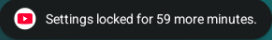
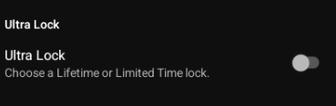
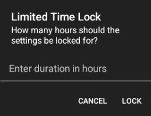
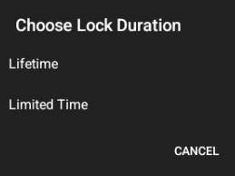
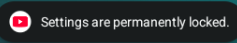

# 🔒 RVX UltraLock - Focus Mode YouTube

  

RVX UltraLock is a customized version of **YouTube ReVanced Extended (RVX)** designed for digital wellbeing. It introduces a powerful **Ultra Lock** mechanism that prevents access to the YouTube settings menu for a set duration, helping you stay focused and avoid the temptation of bypassing your content filters.

---

## ✨ Key Features

### 🕒 Ultra Lock (Focus Mode)
The hallmark feature of this build. Found under **RVX Settings > Miscellaneous**, it allows you to:
- **Lifetime Lock**: Permanently block access to all RVX and native YouTube settings.
- **Limited Time Lock**: Lock settings for a specific number of hours (e.g., 1, 10, or 100 hours).
- **Hard Enforcement**: Once locked, the app will automatically exit the settings menu and show a toast notifying you of the remaining time.

### 🖼️ Preview

  
  

### 📢 Notifications
The app keeps you informed when you attempt to enter the "danger zone":

  
  

---

## 📥 Installation

1. **Download the APK**: Grab the latest `rvx-ultralock-default.apk` from the [Releases](https://github.com/DevXtechnic/RVX-UltraLock/releases) page.
2. **Install MicroG (Required)**: For non-rooted devices, you **must** install GmsCore (MicroG) to sign in.
   - [📥 Download ReVanced GmsCore here](https://github.com/ReVanced/GmsCore/releases)
3. **Enjoy Focus Mode**: Open the app, go to **Settings > RVX Settings > Miscellaneous**, toggle **Ultra Lock**, and choose your poison.

---

## 🙏 Credits & Acknowledgments

This project is built upon the incredible work of the following developers:
- **[Anddea](https://github.com/anddea)**: For maintaining the high-quality YouTube RVX patches used as the foundation for this project.
- **[ReVanced Team](https://github.com/ReVanced)**: For creating the revolutionary patching framework that makes these modifications possible.

---

## 🛠️ Developer Information

This repository contains the source code for the patches and the shared extension logic used to build RVX UltraLock.

### How to Build
1. Clone the repository.
2. Run `./gradlew :patches:build` to build the patch bundle.
3. Use the `revanced-cli` to apply the generated patches to a clean YouTube APK.