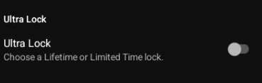
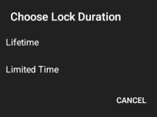
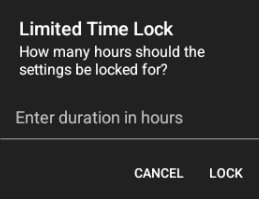

# 🔒 RVX UltraLock - Focus Mode YouTube

<p align="center">
  
</p>

RVX UltraLock is a customized version of **YouTube ReVanced Extended (RVX)** designed for digital wellbeing. It introduces a powerful **Ultra Lock** mechanism that prevents access to the YouTube se[...]

---

## ✨ Key Features

### 🕒 Ultra Lock (Focus Mode)
The hallmark feature of this build. Found under **RVX Settings > Miscellaneous**, it allows you to:
- **Lifetime Lock**: Permanently block access to all RVX and native YouTube settings.
- **Limited Time Lock**: Lock settings for a specific number of hours (e.g., 1, 10, or 100 hours).
- **Hard Enforcement**: Once locked, the app will automatically exit the settings menu and show a toast notifying you of the remaining time.

### 🖼️ Preview
<p align="center">
  
  
</p>

### 📢 Notifications
The app keeps you informed when you attempt to enter the "danger zone":
<p align="center">
  
  
</p>

---

## 📥 Installation

1. **Download the APK**: Grab the latest `rvx-ultralock-default.apk` from the [Releases](https://github.com/DevXtechnic/RVX-UltraLock/releases) page.
2. **Install MicroG (Required)**: For non-rooted devices, you **must** install GmsCore (MicroG) to sign in.
   - [📥 Download ReVanced GmsCore here](https://github.com/ReVanced/GmsCore/releases)
3. **Enjoy Focus Mode**: Open the app, go to **Settings > RVX Settings > Miscellaneous**, toggle **Ultra Lock**, and choose your poison.

---

## 🙏 Credits & Acknowledgments

This project is built upon the incredible work of the following developers:
- **[Anddea](https://github.com/anddea)**: For maintaining the high-quality YouTube RVX patches used as the foundation for this project.
- **[ReVanced Team](https://github.com/ReVanced)**: For creating the revolutionary patching framework that makes these modifications possible.

---

## 🛠️ Developer Information

This repository contains the source code for the patches and the shared extension logic used to build RVX UltraLock.

### How to Build
1. Clone the repository.
2. Run `./gradlew :patches:build` to build the patch bundle.
3. Use the `revanced-cli` to apply the generated patches to a clean YouTube APK.

---

## 🧩 Minimalist config (Import instructions)

You can import the following minimalist configuration into RVX via Settings > RVX Settings > Miscellaneous > Import settings. You may either paste the config as text or save it as a `.txt` file and import the file.

Import as text (recommended):

1. Open RVX -> Settings -> RVX Settings -> Miscellaneous -> Import settings -> Import as text.
2. Paste the JSON block shown below and save.

Import from a .txt file:

1. Download the pre-made file: [minimalist-config.txt](minimalist-config.txt) (or create a file named `minimalist-config.txt` and paste the RVX-format block below).
2. In the app, choose Import settings -> Import from file and select the file.

Note: RVX accepts two formats:
- JSON (for the "Import as text" flow) — full JSON object with surrounding { }.
- RVX .txt format (line-delimited key:value pairs without surrounding braces) — useful for "Import from file" when the app expects plain lines.

JSON (for Import as text):

```json
  "alt_thumbnail_home": "dearrow",
  "alt_thumbnail_library": "dearrow",
  "alt_thumbnail_player": "dearrow",
  "alt_thumbnail_search": "dearrow",
  "alt_thumbnail_subscriptions": "dearrow",
  "append_time_stamp_information_playback_speed_menu_type": "custom_no_theme",
  "bypass_image_region_restrictions": true,
  "change_form_factor": "small",
  "change_live_ring_click_action": true,
  "change_player_flyout_menu_toggle": true,
  "change_shorts_background_repeat_state": "end_screen",
  "change_shorts_repeat_state": "end_screen",
  "change_start_page": "library",
  "change_start_page_type": true,
  "change_youtube_header": false,
  "custom_filter": true,
  "custom_filter_strings": "carousel_header\\nchannel_action_button\\nchannel_banner\\nchannel_description_preview\\nchannel_header_links\\ncompact_channel_bar\\ncompact_channel_bar_header\\nexpandable_list_inner\\nexpandable_product_grid\\ngrid_channel_shelf\\nimage_attachment\\ninline_expander\\nmulti_image_attachment\\noffer_box\\npost_attachment_container\\npost_author\\npost_base\\npost_comment_button\\npost_content\\npost_header\\npost_like_count\\npost_like_dislike\\npost_time_text\\nproduct_offers\\nquick_actions\\nrelated_community_post\\nrelated_video\\nshopping_flagging\\nshorts_shelf\\nsnappy_horizontal_shelf\\nstyled_product_carousel\\nsubscribe_button\\nvideo_action_toggle_button\\nvideo_lockup$relatedH",
  "custom_playback_speed_menu_type": "custom_no_theme",
  "custom_playback_speeds": "0.25\\n0.5\\n0.75\\n1.0\\n1.25\\n1.5\\n1.75\\n2.0\\n2.25\\n2.5\\n2.75\\n3",
  "custom_seekbar_color_accent": "#FF0033",
  "default_playback_speed": 1.25,
  "default_playback_speed_shorts": 3,
  "default_video_quality_wifi": 240,
  "default_video_quality_wifi_shorts": 2160,
  "disable_ambient_mode": true,
  "disable_ambient_mode_in_fullscreen": true,
  "disable_auto_audio_tracks": true,
  "disable_auto_player_popup_panels": false,
  "disable_auto_switch_mix_playlists": true,
  "disable_default_playback_speed_music": false,
  "disable_haptic_feedback_chapters": true,
  "disable_haptic_feedback_scrubbing": true,
  "disable_haptic_feedback_seek": true,
  "disable_haptic_feedback_seek_undo": true,
  "disable_haptic_feedback_zoom": true,
  "disable_like_dislike_glow": true,
  "disable_resuming_miniplayer": true,
  "disable_rolling_number_animations": true,
  "disable_shorts_background_playback": true,
  "disable_shorts_like_button_fountain_animation": true,
  "disable_signin_to_tv_popup": true,
  "disable_splash_animation": true,
  "disable_vp9_codec": true,
  "enable_comments_scroll_top": true,
  "enable_custom_seekbar_color": true,
  "enable_narrow_navigation_buttons": true,
  "enable_opus_codec": false,
  "enable_wide_search_bar": true,
  "enable_wide_search_bar_in_you_tab": true,
  "enable_wide_search_bar_with_header": false,
  "expand_video_description": true,
  "hide_account_menu": true,
  "hide_account_menu_filter_strings": "Your videos\\nMovies\\nBadges\\nYour movies\\nGet YouTube Premium\\nPurchases and memberships\\nHelp & feedback\\nTry YouTube Premium for NPR 0\\nRestrictions apply. Cancel anytime.",
  "hide_account_menu_filter_type": true,
  "hide_ai_chat_summary": true,
  "hide_ai_comments_summary": true,
  "hide_attributes_section": true,
  "hide_autoplay_preview": true,
  "hide_carousel_shelf_home": true,
  "hide_carousel_shelf_search": true,
  "hide_carousel_shelf_subscriptions": true,
  "hide_category_bar_in_feed": true,
  "hide_category_bar_in_history": true,
  "hide_category_bar_in_playlist": true,
  "hide_category_bar_in_related_videos": true,
  "hide_category_bar_in_search": true,
  "hide_channel_tab": true,
  "hide_channel_tab_filter_strings": "Home\\nLive\\nShorts\\nStore\\nPosts\\n    ",
  "hide_clip_button": true,
  "hide_comments_button": true,
  "hide_comments_by_members": true,
  "hide_comments_create_a_short_button": true,
  "hide_comments_emoji_and_timestamp_buttons": true,
  "hide_comments_highlighted_search_links": true,
  "hide_comments_section": true,
  "hide_comments_section_in_home_feed": true,
  "hide_comments_thanks_button": true,
  "hide_community_posts_channel": true,
  "hide_community_posts_subscriptions": true,
  "hide_contents_section": true,
  "hide_end_screen_cards": true,
  "hide_feed_flyout_menu": true,
  "hide_feed_flyout_menu_filter_strings": "Remix\\nNot interested\\nDon't recommend channel\\nReport\\nListen with YouTube Music",
  "hide_feed_flyout_menu_filter_type": true,
  "hide_floating_button": true,
  "hide_hype_button": true,
  "hide_info_cards": true,
  "hide_info_cards_section": true,
  "hide_keyword_content_comments": true,
  "hide_keyword_content_search": true,
  "hide_keyword_content_subscriptions": true,
  "hide_keyword_content_use_and_operator": true,
  "hide_like_dislike_button": true,
  "hide_live_chat_messages": true,
  "hide_live_chat_replay_button": true,
  "hide_mix_playlists": true,
  "hide_movie_shelf": true,
  "hide_navigation_home_button": true,
  "hide_navigation_label": true,
  "hide_navigation_notifications_button": true,
  "hide_navigation_shorts_button": true,
  "hide_navigation_subscriptions_button": true,
  "hide_notify_me_button": true,
  "hide_playables": true,
  "hide_player_flyout_menu_additional_settings": true,
  "hide_player_flyout_menu_ambient_mode": true,
  "hide_player_flyout_menu_audio_track": true,
  "hide_player_flyout_menu_captions_footer": false,
  "hide_player_flyout_menu_lock_screen": true,
  "hide_player_flyout_menu_loop_video": true,
  "hide_player_flyout_menu_more_info": true,
  "hide_player_flyout_menu_report": true,
  "hide_player_flyout_menu_sleep_timer": true,
  "hide_player_flyout_menu_stable_volume": true,
  "hide_player_flyout_menu_stats_for_nerds": true,
  "hide_player_youtube_music_button": true,
  "hide_podcast_section": true,
  "hide_preview_comment": true,
  "hide_preview_comment_new_method": true,
  "hide_preview_comment_type": true,
  "hide_promote_button": true,
  "hide_quick_actions": true,
  "hide_quick_actions_comment_button": true,
  "hide_quick_actions_dislike_button": true,
  "hide_quick_actions_like_button": true,
  "hide_quick_actions_live_chat_button": true,
  "hide_quick_actions_more_button": true,
  "hide_quick_actions_open_mix_playlist_button": true,
  "hide_quick_actions_save_to_playlist_button": true,
  "hide_quick_actions_share_button": true,
  "hide_related_videos": true,
  "hide_related_videos_overlay": true,
  "hide_remix_button": true,
  "hide_report_button": true,
  "hide_rewards_button": true,
  "hide_search_term_thumbnail": true,
  "hide_settings_menu_about": true,
  "hide_settings_menu_accessibility": true,
  "hide_settings_menu_account": true,
  "hide_settings_menu_autoplay_playback": true,
  "hide_settings_menu_billing_and_payment": true,
  "hide_settings_menu_captions": true,
  "hide_settings_menu_connected_accounts": true,
  "hide_settings_menu_data_saving": true,
  "hide_settings_menu_general": true,
  "hide_settings_menu_history": true,
  "hide_settings_menu_live_chat": true,
  "hide_settings_menu_notification": true,
  "hide_settings_menu_offline": true,
  "hide_settings_menu_pair_with_tv": true,
  "hide_settings_menu_parent_tools": true,
  "hide_settings_menu_premium_early_access": true,
  "hide_settings_menu_privacy": true,
  "hide_settings_menu_subscription_product": true,
  "hide_settings_menu_video_quality": true,
  "hide_settings_menu_your_data": true,
  "hide_shop_button": true,
  "hide_shorts_channel_bar": true,
  "hide_shorts_comments_button": true,
  "hide_shorts_dislike_button": true,
  "hide_shorts_like_button": true,
  "hide_shorts_live_header": true,
  "hide_shorts_navigation_bar": true,
  "hide_shorts_paused_header": true,
  "hide_shorts_paused_overlay_buttons": true,
  "hide_shorts_share_button": true,
  "hide_shorts_shelf": true,
  "hide_shorts_shelf_channel": true,
  "hide_shorts_shelf_history": true,
  "hide_shorts_toolbar": true,
  "hide_shorts_video_title": true,
  "hide_stop_ads_button": true,
  "hide_subscribed_channels_bar": true,
  "hide_thanks_button": true,
  "hide_toolbar_create_button": true,
  "hide_toolbar_notification_button": true,
  "hide_transcript_section": true,
  "hide_video_by_view_counts_home": true,
  "hide_video_by_view_counts_search": true,
  "hide_video_by_view_counts_subscriptions": true,
  "hide_video_view_counts_less_than": 500,
  "hide_voice_search_button": true,
  "hide_you_may_like_section": true,
  "hide_youtube_doodles": true,
  "invert_snack_bar_theme": true,
  "miniplayer_hide_subtext": true,
  "miniplayer_type": "modern_3",
  "open_shorts_in_regular_player": true,
  "overlay_button_gemini_summarize": false,
  "overlay_button_gemini_summarize_api_key": "",
  "overlay_button_play_all_type": "videos_only_with_popular_descending",
  "overlay_button_speed_dialog": true,
  "remove_viewer_discretion_dialog": true,
  "replace_toolbar_create_button": true,
  "sanitize_comments_category_bar": true,
  "sanitize_video_subtitle": true,
  "shorts_double_tap_to_like_animation": "hidden",
  "skip_autoplay_countdown": true,
  "speed_overlay_value": 3,
  "spoof_app_version_target": "19.16.39",
  "spoof_streaming_data": true,
  "spoof_streaming_data_prioritize_video_quality": true,
  "spoof_streaming_data_reload_video_button": false,
  "spoof_streaming_data_reload_video_button_always_show": false,
  "spoof_streaming_data_stats_for_nerds": false,
  "spoof_streaming_data_use_js": true,
  "spoof_streaming_data_use_js_all": true,
  "spoof_streaming_data_use_js_bypass_fake_buffering": true,
  "swipe_brightness_distance": 75,
  "swipe_overlay_progress_brightness_color": "#FFFFFF",
  "swipe_overlay_progress_volume_color": "#FFFFFF",
  "swipe_overlay_rect_size": 30,
  "swipe_speed": false,
  "swipe_text_overlay_size": 16,
  "swipe_volume_distance": 75,
  "ryd_compact_layout": true,
  "sb_hook": "skip",
  "sb_interaction": "skip",
  "sb_intro": "skip",
  "sb_local_time_saved_milliseconds": 6561145,
  "sb_local_time_saved_number_segments": 236,
  "sb_outro": "skip",
  "sb_selfpromo": "skip",
  "sb_sponsor": "skip"
```
